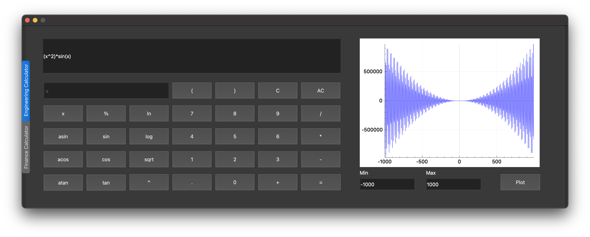

# EngineeringCalc

## Part 1. Implementation of SmartCalc v2.0 

- The program must be developed in C++ language of C++17 standard
- The program code must be located in the src folder
- When writing code it is necessary to follow the Google style
- Classes must be implemented within the `s21` namespace
- Prepare full coverage of expression calculation modules with unit-tests using the GTest library
- The program must be built with Makefile which contains standard set of targets for GNU-programs: all, install, uninstall, clean, dvi, dist, tests. Installation directory could be arbitrary
- GUI implementation, based on any GUI library with API for C++17:
  * For Linux: GTK+, CEF, Qt, JUCE
  * For Mac: GTK+, CEF, Qt, JUCE, SFML, Nanogui, Nngui
- The program must be implemented using the MVC pattern, and also:
   - there should be no business logic code in the view code
   - there should be no interface code in the controller and the model
   - controllers must be thin
- Both integers and real numbers with a dot can be input into the program. You should provide the input of numbers in exponential notation
- The calculation must be done after you complete entering the calculating expression and press the `=` symbol.
- Calculating arbitrary bracketed arithmetic expressions in infix notation
- Calculate arbitrary bracketed arithmetic expressions in infix notation with substitution of the value of the variable _x_ as a number
- Plotting a graph of a function given by an expression in infix notation with the variable _x_ (with coordinate axes, mark of the used scale and an adaptive grid)
   - It is not necessary to provide the user with the ability to change the scale
- Domain and codomain of a function are limited to at least numbers from -1000000 to 1000000
   - To plot a graph of a function it is necessary to additionally specify the displayed domain and codomain
- Verifiable accuracy of the fractional part is at least to 7 decimal places
- Users must be able to enter up to 255 characters
- Bracketed arithmetic expressions in infix notation must support the following arithmetic operations and mathematical functions:
   - **Arithmetic operators**:
     | Operator name | Infix notation   (Classic) | Prefix notation   (Polish notation) |  Postfix notation   (Reverse Polish notation) |
      | --------- | ------ | ------ | ------ |
      | Brackets | (a + b) | (+ a b) | a b + |
      | Addition | a + b | + a b | a b + |
      | Subtraction | a - b | - a b | a b - |
      | Multiplication | a * b | * a b | a b * |
      | Division | a / b | / a b | a b \ |
      | Power | a ^ b | ^ a b | a b ^ |
      | Modulus | a mod b | mod a b | a b mod |
      | Unary plus | +a | +a | a+ |
      | Unary minus | -a | -a | a- |
      >Note that the multiplication operator contains the obligatory sign `*`. Processing an expression with the omitted `*` sign is optional and is left to the developer's decision
   - **Functions**:
      | Function description | Function |
      | ------ | ------ |
      | Computes cosine | cos(x) |
      | Computes sine | sin(x) |
      | Computes tangent | tan(x) |
      | Computes arc cosine | acos(x) |
      | Computes arc sine | asin(x) |
      | Computes arc tangent | atan(x) |
      | Computes square root | sqrt(x) |
      | Computes natural logarithm | ln(x) |
      | Computes common logarithm | log(x) |

## Part 2. Credit calculator

Provide a special mode "credit calculator" (you can take banki.ru and calcus.ru as an example):
- Input: total credit amount, term, interest rate, type (annuity, differentiated)
- Output: monthly payment, overpayment on credit, total payment
, deposit amount by the end of the term